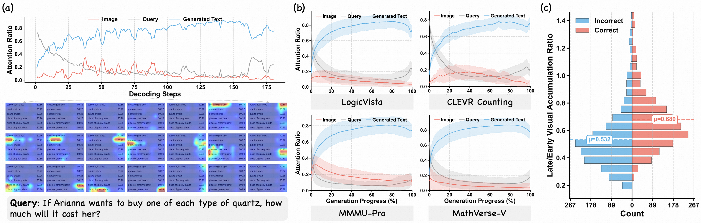
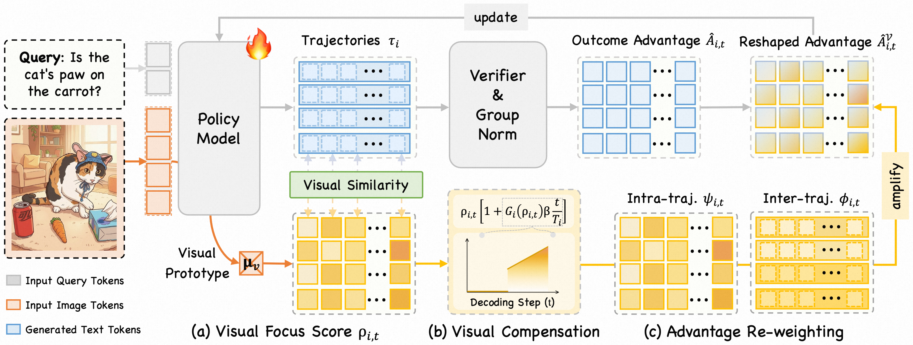

<div align="center">

  <h1>
    VGPO: Visually-Guided Policy Optimization for Multimodal Reasoning
  </h1>  

  <p align="center">
    <a href='https://arxiv.org/abs/2604.09349'>
      
    </a>
    &nbsp;
    <a href='https://huggingface.co/papers/2604.09349'>
      
    </a>
    &nbsp;
    <a href='https://huggingface.co/MuMing0102/VGPO-RL-7B'>
      
    </a>
    &nbsp;
    <a href='https://huggingface.co/MuMing0102/VGPO-RL-32B'>
      
    </a>
  </p>

</div></font>

## 🔥 News
  - 🔥 **[2026.04]**: 🎉🎉🎉 Congratulations! Our paper is accepted by ACL 2026 (Main Conference).

## 📖 Overview of VGPO

  Standard RLVR methods treat every generated token equally, broadcasting a single reward signal indiscriminately. This leads to **signal dilution** — generic text tokens receive the same reinforcement as critical visually-grounded reasoning steps. Meanwhile, **temporal visual forgetting** causes attention to visual inputs to progressively decay as reasoning chains extend.
  
  VGPO addresses these issues through three key mechanisms:
  - **Visual Attention Compensation (VAC):** Uses the inherent hidden-state similarity between generated tokens and image tokens as a *Visual Focus Score* to localize visual activations without external supervision. A progressive incentive schedule counteracts temporal visual forgetting in later reasoning steps.
  - **Intra-Trajectory Re-weighting:** At the token level, dynamically re-weights advantages by visual focus scores to amplify learning from visually-grounded tokens.
  - **Inter-Trajectory Re-weighting:** At the trajectory level, prioritizes rollouts with superior visual accumulation, favoring trajectories that sustain consistent visual grounding.
  
  <p align="center">
    
    <figcaption>
      <p align="center">
        Analysis of the inference nature of multimodal reasoning trajectory (based on Qwen2.5-VL-7B).
      </p>
    </figcaption>
    <!-- <figcaption style="text-align: center;">
      Analysis of the inference nature of multimodal reasoning trajectory (based on Qwen2.5-VL-7B). (a) An example of attention allocation across image, query, and generated text tokens (normalized to 1 at each step). (b) Average attention statistics on four visual-dependent benchmarks. (c) Distribution of late/early visual accumulation ratios for incorrect (left) vs. correct (right) samples of these four benchmarks. Incorrect samples often exhibit higher visual forgetting.
    </figcaption> -->
  </p>
  
  <p align="center">
    
    <figcaption>
      <p align="center">
        Overview of Visually-Guided Policy Optimization framework.
      </p>
    </figcaption>
    <!-- <figcaption style="text-align: center;">
      Overview of Visually-Guided Policy Optimization framework. Given query and image, (a) VGPO firstly utilizes the intrinsic hidden state similarity between generated tokens and visual prototype to derive a Visual Focus Score for visual token localization. (b) Then, Visual Attention Compensation (VAC) mechanism leverages this score to re-focus visual tokens, while progressively elevating visual expectations along decoding steps to counteract temporal visual forgetting. (c) Finally, Dual-grained Advantage Re-weighting strategy integrates VAC mechanism into intra- and inter-trajectory levels to explicitly incentivize sustained visual faithfulness during policy updates.
    </figcaption> -->
    
  </p>
  

## 🔧 Getting Started
  
  ```bash
  conda create -n vgpo python=3.10 -y
  conda activate vgpo
  
  git clone https://github.com/wzb-bupt/VGPO.git
  cd VGPO
  
  pip install -e .
  ```
  
## 🚀 Training
  
  ```bash
  bash train_vgpo_7B.sh
  ```

  The training script exposes the core VGPO hyperparameters as follows. All other hyperparameters use sensible defaults in the code. See `verl/trainer/config.py` for the full configuration.
  
  ```bash
  # ── Dual-Grained Advantage Re-weighting ──
  use_intra_trajectory_reweighting=true   # Eq.7-8: token-level reweighting by visual focus score ψ_{i,t}
  use_inter_trajectory_reweighting=true   # Eq.9-11: trajectory-level reweighting by visual accumulation ϕ_i
  
  # ── Visual Attention Compensation ──
  use_visual_compensation=true            # Eq.5: progressive compensation β·(t/T)
  use_gated_visual_compensation=true      # Eq.6: visual gate G_i(ρ) for late-stage tokens
  gated_visual_compensation_start_ratio=0.5  # γ in Eq.6: tail ratio threshold
  visual_compensation_strength=0.3        # β in Eq.5: compensation intensity
  visual_attention_threshold=0.2          # κ in Eq.6: top-κ% gate activation threshold
  ```
  
## 📊 Evaluation
  
  We follow the evaluation script of [Look-Back](https://github.com/PKU-YuanGroup/Look-Back). All results are reported as **average accuracy** with inference temperature **0.0**. 

  ### Supported Training Datasets
  
  | Split | Dataset | Link |
  |:------|:--------|:-----|
  | Train | ViRL39K | [PAPOGalaxy/PAPO_ViRL39K_train](https://huggingface.co/datasets/PAPOGalaxy/PAPO_ViRL39K_train) |
  | Val   | MMK12   | [PAPOGalaxy/PAPO_MMK12_test](https://huggingface.co/datasets/PAPOGalaxy/PAPO_MMK12_test) |
  
  ### Supported Evaluation Benchmarks
  
  | Benchmark           | Focus Domain                               |
  |:--------------------|:-------------------------------------------|
  | MathVista           | General Mathematical & Geometric Reasoning |
  | MathVerse           | General Mathematical & Geometric Reasoning |
  | WeMath              | General Mathematical & Geometric Reasoning |
  | MMK12               | General Mathematical & Geometric Reasoning |
  | GeoMath             | General Mathematical & Geometric Reasoning |
  | Geometry3K          | General Mathematical & Geometric Reasoning |
  | LogicVista          | Vision-dependent Multimodal Reasoning      |
  | SuperClevr Counting | Vision-dependent Multimodal Reasoning      |
  | MMMU-Pro            | Vision-dependent Multimodal Reasoning      |
  | MathVerse-V         | Vision-dependent Multimodal Reasoning      |


## ✍️ Citation

  If you find this codebase useful in your research, please consider giving us a star ⭐ and citing our work 📝:
  
  ```bibtex
  @article{wang2026vgpo,
    title={Visually-Guided Policy Optimization for Multimodal Reasoning}, 
    author={Zengbin Wang and Feng Xiong and Liang Lin and Xuecai Hu and Yong Wang and Yanlin Wang and Man Zhang and Xiangxiang Chu},
    journal={arXiv preprint arXiv:2604.09349},
    year={2026}
  }
```

## Acknowledgements

  Our codebase is built upon [EasyR1](https://github.com/hiyouga/EasyR1), [VPPO-RL](https://github.com/huaixuheqing/VPPO-RL), [PAPO](https://github.com/MikeWangWZHL/PAPO), [Look-Back](https://github.com/PKU-YuanGroup/Look-Back). We thank the authors for their excellent work.
